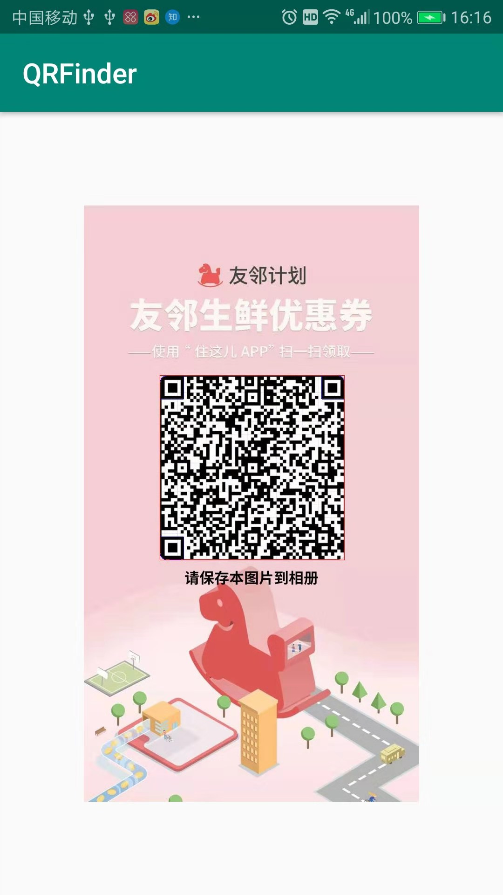
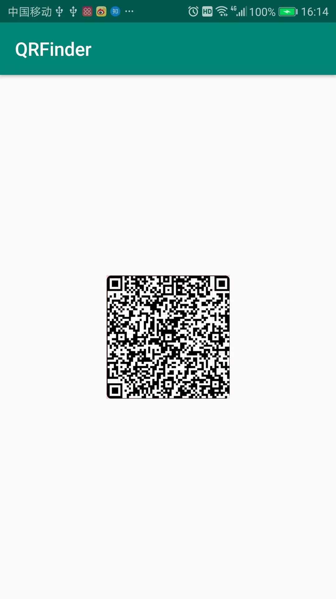

# qrfinder
qr 寻找器

# 介绍
这是一个基于opencv3 的 qr寻找器

How to use it:
if you have a img like below:


we want to find a qr from img,and draw a rect on origin picture:
(如果你想从原图中查找二维码区域并且绘制下来，调用如下)
```
Bitmap bitmap = BitmapFactory.decodeResource(getResources(),R.mipmap.test3);


        imageView.setImageBitmap(QRFinder.findQR(bitmap));
```
you can get the result like blow:
(你能获得下面这种图)


if you only wan to get the rect of qr,you can use this method:
(如果你只想获取图片中二维码的区域，可以使用如下方法)
```
Bitmap[] getAllQrRect(DisplayMetrics metrics, Bitmap bitmap,boolean isBinary)
```

it will response all the QR Liked Rect;
(该方法会获得所有可能是二维码的区域)
if you set params isBinary be false:
(如果你设置参数isBinary 是false)
you will get the QR rect from origin picture：
(你将会获得一个QR区域从原图中截取出来)



if you set params isBinary be true：
(如果你设置参数isBinary true)
you will get QR rect from Binary picture：
(你将会获得一个QR区域从处理过的二值化图片中中截取出来)


# 原理
这个二维码寻找器，是通过查找有两个以上的父子轮廓，拿到可能是二维码标识的方块，接着查找所有面积相似的二维码方块，并且划分出来。
最后再通过这几个方块不断的组合夹角，只有90左右的夹角且是三个面积相似的双轮廓的标识位才可能是二维码。最后截取囊括这些双轮廓的区域出来。

你可以试试上面那个二维码直接保存到相册里面，使用zxing是无法正常识别，是因为周边有一个黑色的框在干扰zxing寻找二维码标识位，这里做的工作是通过先膨胀后腐蚀，把一些无用的干扰去掉。

注意本库只支持armeabi-v7a

这是作者我认为二维码应该有通用的特征。如果有更棒的想法，欢迎提出来。
